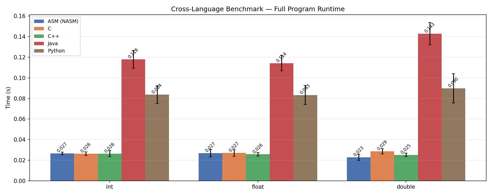

# asm_matrix_benchmark

跨语言矩阵运算基准测试项目，对比 **汇编 (NASM)**、**C**、**C++**、**Java** 和 **Python** 五种语言在 **int**、**float**、**double** 三种数据类型下的性能差异。

## 概述

本项目用 5 种语言实现了一套完整的矩阵运算库，并提供一键基准测试脚本，用于衡量和可视化不同语言 / 数据类型之间的运行耗时差异。

## 项目结构

```
├── CMakeLists.txt              # 构建配置 (C / C++ / NASM)
├── include/                    # C/C++ 头文件 (.h)
├── src/
│   ├── C/                      # C 实现 (int/float/double)
│   ├── C++/
│   │   ├── int/                # C++ MatrixInt
│   │   ├── float/              # C++ MatrixFloat
│   │   └── double/             # C++ MatrixDouble
│   ├── Java/                   # Java 矩阵类
│   ├── Python/                 # Python 矩阵模块
│   └── assembly/
│       ├── linux/              # NASM 汇编 (Linux x86-64)
│       └── windows/            # NASM 汇编 (Windows x64)
├── example/                    # 5 种语言的示例程序
├── out/                        # 编译后的 Java .class 文件
├── benchmark/                  # 基准测试脚本 & 图表
│   ├── bench_cross.py          # 一键跨语言基准测试
│   ├── bench_python.py         # Python 微基准测试（被 bench_cross 调用）
│   ├── bench_results.json      # 最新结果
│   └── bench_comparison.png    # 生成的对比柱状图
└── build/                      # CMake 构建输出
```

## 支持的语言与数据类型

| 语言 | int | float | double |
|----------|:---:|:-----:|:------:|
| 汇编 (NASM) | ✅ | ✅ | ✅ |
| C | ✅ | ✅ | ✅ |
| C++ | ✅ | ✅ | ✅ |
| Java | ✅ | ✅ | ✅ |
| Python | ✅ | ✅¹ | ✅¹ |

¹ Python 的 `float` 就是 IEEE 754 双精度，float 和 double 使用同一套实现。

## 一键基准测试

```bash
# 运行所有可用语言（自动探测编译好的二进制）
python benchmark/bench_cross.py

# 指定语言运行
python benchmark/bench_cross.py --langs asm,c,cpp,java,python

# 自定义重复次数
python benchmark/bench_cross.py --repeat 10 --warmup 3
```

输出：
- 控制台汇总表
- `benchmark/bench_results.json`
- `benchmark/bench_comparison.png`（按数据类型分组的柱状对比图）

## 构建 (C / C++ / 汇编)

### 前置要求

- CMake >= 3.10
- C/C++ 编译器 (GCC / Clang / MSVC)
- NASM 汇编器

### 构建

```bash
mkdir build && cd build
cmake .. -DCMAKE_BUILD_TYPE=Release
cmake --build .
```

### 可执行目标

| 目标 | 语言 | 数据类型 |
|--------|----------|-----------|
| `matrix_int` | 汇编 (NASM) | int |
| `matrix_intc` | C | int |
| `matrix_intcpp` | C++ | int |
| `matrix_float` | 汇编 (NASM) | float |
| `matrix_floatc` | C | float |
| `matrix_floatcpp` | C++ | float |
| `matrix_double` | 汇编 (NASM) | double |
| `matrix_doublec` | C | double |
| `matrix_doublecpp` | C++ | double |

## Java

```bash
# 编译（bench_cross.py 会自动执行）
javac -d src/Java src/Java/MatrixInt.java src/Java/MatrixDouble.java src/Java/MatrixFloat.java
javac -cp src/Java -d out example/matrix_int.java example/matrix_float.java example/matrix_double.java

# 运行
java -cp out;src/Java matrix_int
```

## 测试方法

`bench_cross.py` 运行每种语言的完整示例程序，测量从启动到退出的总耗时（wall-clock time），包括：
- 进程启动 / JVM / 解释器初始化
- 矩阵构造和数据初始化
- 所有运算（add、sub、mul、find、scale、transpose 等）
- 结果打印输出

每项组合重复 N 次（默认 5），带预热运行以获取稳定数据。

## 基准测试结果



### 主要结论

| 语言 | int (s) | float (s) | double (s) |
|----------|:-------:|:---------:|:----------:|
| 汇编 (NASM) | 0.0266 | 0.0268 | 0.0228 |
| C | 0.0264 | 0.0271 | 0.0287 |
| C++ | 0.0265 | 0.0257 | 0.0252 |
| Java | 0.1179 | 0.1141 | 0.1429 |
| Python | 0.0837 | 0.0832 | 0.0898 |

- **编译型原生语言（汇编、C、C++）** 速度最快，全部在 ~0.022–0.029&nbsp;s 范围内。现代编译器的优化能力已接近手写汇编。
- **Python** 比原生慢约 3 倍（~0.08–0.09&nbsp;s），主要开销来自解释器和动态类型。
- **Java** 比原生慢约 4–5 倍（~0.11–0.14&nbsp;s），其中 JVM 启动时间占了相当一部分比例。
- **汇编 double 比 int 略快**——SSE2 标量运算（`addsd`、`mulsd`）比 int 矩阵使用的分数运算更简单。
- **C++** 在三种数据类型上表现一致，float/double 略有优势。

## Python 模块

```python
from src.Python import Matrix, transpose, rank, trace

m = Matrix(3, 3, [1, 2, 3, 4, 5, 6, 7, 8, 10])
print(rank(m))    # 3
print(trace(m))   # 16
```

### Python 文件列表

| 文件 | 内容 |
|------|----------|
| `base_matrix.py` | `Matrix` 类（核心运算符） |
| `concat_matrix.py` | `cat_matrix()` 矩阵拼接 |
| `determinant_matrix.py` | `determinant()` 行列式 |
| `extract_matrix.py` | `extract_row()`, `extract_col()`, `extract_submatrix()` |
| `find_matrix.py` | `find_elem()` 元素查找 |
| `inv_matrix.py` | `inv_matrix()` 逆矩阵 |
| `leading_minors.py` | `leading_minors()` 顺序主子式 |
| `lu_decomposition.py` | `lu_decomposition()` LU 分解 |
| `random_matrix.py` | `random_matrix()` 随机矩阵 |
| `rank_matrix.py` | `rank()` 矩阵秩 |
| `replace_matrix.py` | `replace_pos()`, `replace_elem()` 替换 |
| `special_matrix.py` | `identity()`, `zeros()`, `ones()` 特殊矩阵 |
| `trace_matrix.py` | `trace()` 矩阵迹 |
| `transpose_matrix.py` | `transpose()` 矩阵转置 |

## 汇编实现

项目为 Windows x64 平台提供了 **int**、**float** 和 **double** 三种数据类型的 NASM 汇编实现，以及 Linux x86-64 的 **int** 实现。double 汇编使用 SSE2 指令集（`movsd`、`addsd`、`subsd`、`mulsd`、`divsd`、`comisd`）进行 IEEE 754 双精度浮点运算。

### 支持的汇编运算

| 类别 | 运算 |
|----------|------------|
| 算术 | `add`, `sub`, `mul`, `scale`, `cat` (拼接) |
| 查询 | `find`, `compare`, `rank`, `trace` |
| 变换 | `transpose`, `inv`, `LU_decomposition`, `leading_minors` |
| 工具 | `print`, `random`, `special` (identity/zeros/ones) |
| 提取 | `extract_row`, `extract_col`, `extract_submatrix` |
| 替换 | `replace_by_coord`, `replace_by_value` |

## 许可证

MIT License — 详见 [LICENSE](LICENSE)。
